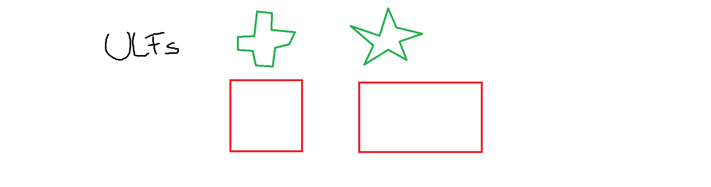

```vb
Private Sub Button_HideLabel(ByVal sender As Object, ByVal e As EventArgs)
   myLabel.Visible = False
End Sub


Private Sub AddVisibleChangedEventHandler()
   AddHandler myLabel.VisibleChanged, AddressOf Label_VisibleChanged
End Sub


Private Sub Label_VisibleChanged(ByVal sender As Object, ByVal e As EventArgs)
   MessageBox.Show("Visible change event raised!!!")
End Sub
```

# NUR NET HUDLN

VISIBLE CHANGED

[back](./)

VISIBLECHANGED

[Modul: Höhere Lehranstalt für Tourismus](https://modul.at/ausbildungsprogramme/hoehere-lehranstalt-fuer-tourismus)

FORMAT LAYOUT POSITION CSSMEDIA


```vbnet
Module Module1

    Sub Main()
        Dim c As New Counter()
        AddHandler c.ThresholdReached, AddressOf c_ThresholdReached

        ' provide remaining implementation for the class
    End Sub

    Sub c_ThresholdReached(sender As Object, e As EventArgs)
        Console.WriteLine("The threshold was reached.")
    End Sub
End Module
```

"Meine Meinung mit meinen Erfahrungen bezüglich .NET und visual basic ist, dass die Sicherheitsstufen für visual basic public, private, shared und so weiter in Dateien der Dateierweiterung *.vb gefasst in Module End Module anders eingegeben werden sollen weil meiner Sicht folgend die allgemein nicht offiziel dargestellte Variante in Registrierdateien für Kontextmenüs der Elektrizität um Strom verstehen und erklären zu können im Datenschutz anders gewertet werden soll (meine von mir nicht betstätigte Variante einer Meldung). Siehe:Straßenbahn, den die Oberleitungen neben der physikalischen Spannung die elektrische Spannung im Bereich Steigleitung meiner Sicht folgend nachsich ziehen würde das die Stromnehmer der Straßenbahn bei idealen Anwendungen nicht mit Kontakt mit der Oberleitung sein müssten. Dem zufolge könnten die sozusagen Module bei passenden Bedingungen entkoppelt werden. Das könnte auch bequem studiert werden, schätz ich, da die Fachlehre der Hotelketten Module genannt wurden. Nach erfolgtem anwenden währe mein Namensvorschlag statt ULF S C H W U N G B A H N."



Hm?
