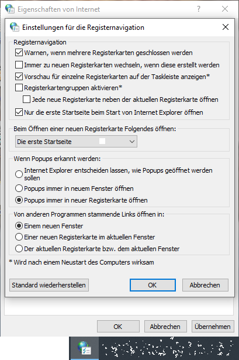

```vb
Private Sub Button_HideLabel(ByVal sender As Object, ByVal e As EventArgs)
   myLabel.Visible = False
End Sub


Private Sub AddVisibleChangedEventHandler()
   AddHandler myLabel.VisibleChanged, AddressOf Label_VisibleChanged
End Sub


Private Sub Label_VisibleChanged(ByVal sender As Object, ByVal e As EventArgs)
   MessageBox.Show("Visible change event raised!!!")
End Sub
```

# NUR NET HUDLN

VISIBLE CHANGED

nun mit der deutsch synchronizierten Sprachart monthy pythons das Ende dieser Seite begünstigt das Wort white space ist aber sehr viel Arbeit.
Ich werde diesbezüglich das Wort nach dem link "back" nicht vor den link schon setzen.

Die meisten haben keine Lizensen, aber . . . es ist nicht . . . aller Tage Abend.
Ich arbeite an einer Vereinfachung im Rahmen von plarium development und ich habe nicht schon begonen. . .

[back](./)

VISIBLECHANGED

#### Counter Notice

If you believe your removed content does not **<mark>?</mark>** infringe, or if you have authorization from the copyright holder, the holder’s agent, or pursuant to law, you may send a counter-notice containing the following information:

- Your physical or electronic signature;
- Identification of the Content that has been removed or to which access has been disabled and the location at which the Content appeared before it was removed or disabled;
- A statement that you have a good faith belief that the Content was removed or disabled as a result of mistake or a misidentification of the Content; and
- Your name, address, telephone number, and e-mail address, a statement that you consent to the jurisdiction of the federal court in San Francisco, California, and a statement that you will accept service of process from the person who provided notification of the alleged infringement.

If a counter-notice is received, Company may send a copy to the original complaining party informing them the content may be replaced or removed in 10 business days. Unless the copyright holder files an action seeking a court order against the Publisher or User, the removed content may be replaced in 10 to 14 business days or after receipt of the counter-notice, at Company’s sole discretion.


[Out of Ctrl by Miknugget](https://miknugget.itch.io/out-of-ctrl)
_~~skip?~~_

[Modul: Höhere Lehranstalt für Tourismus](https://modul.at/ausbildungsprogramme/hoehere-lehranstalt-fuer-tourismus)

FORMAT LAYOUT POSITION CSSMEDIA



```vbnet
Module Module1

    Sub Main()
        Dim c As New Counter()
        AddHandler c.ThresholdReached, AddressOf c_ThresholdReached

        ' provide remaining implementation for the class
    End Sub

    Sub c_ThresholdReached(sender As Object, e As EventArgs)
        Console.WriteLine("The threshold was reached.")
    End Sub
End Module
```

"Meine Meinung mit meinen Erfahrungen bezüglich .NET und visual basic ist, dass die Sicherheitsstufen für visual basic public, private, shared und so weiter in Dateien der Dateierweiterung *.vb gefasst in Module End Module anders eingegeben werden sollen weil meiner Sicht folgend die allgemein nicht offiziel dargestellte Variante in Registrierdateien für Kontextmenüs der Elektrizität um Strom verstehen und erklären zu können im Datenschutz anders gewertet werden soll (meine von mir nicht betstätigte Variante einer Meldung). Siehe:Straßenbahn, den die Oberleitungen neben der physikalischen Spannung die elektrische Spannung im Bereich Steigleitung meiner Sicht folgend nachsich ziehen würde das die Stromnehmer der Straßenbahn bei idealen Anwendungen nicht mit Kontakt mit der Oberleitung sein müssten. Dem zufolge könnten die sozusagen Module bei passenden Bedingungen entkoppelt werden. Das könnte auch bequem studiert werden, schätz ich, da die Fachlehre der Hotelketten Module genannt wurden. Nach erfolgtem anwenden währe mein Namensvorschlag statt ULF S C H W U N G B A H N."

[Elektrosensibilität | Elektrosensibilität](https://www.elektrosensibel-ehs.de/elektrosensibilitat/)

[Wohnraum/ Weiße Zonen | Elektrosensibilität](https://www.elektrosensibel-ehs.de/weisse-zonen/)

[Strahlungsarme Gebiete - Wohnraum für Elektrosensible - wifi-refuge.org](https://wifi-refuge.org/de/white-zones/)

[Elektromagnetische Verträglichkeit und Überspannungsschutz | SpringerLink](https://link.springer.com/chapter/10.1007/978-3-658-14189-9_6)

[Lebens-Oasen | Weisse Zonen](https://www.weissezonen.de/lebens-oase/)
