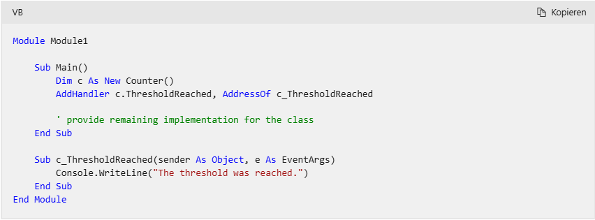

[NUR NET HUDLN:WEIL. . . -klein Adlerauge-](./NUR_NET_HUDLN.html)



```javascript
function getRectArea(width, height) {
  if (width > 0 && height > 0) {
    return width * height;
  }
  return 0;
}

console.log(getRectArea(3, 4));
// Expected output: 12

console.log(getRectArea(-3, 4));
// Expected output: 0
```

Warum üb ich meine Beispiele mit dem hochladen auf github? Größten teils weil die Garantie das usercontent wirklich im Rahmen einer Bestätigung gelöscht wird.
Wie bei jeder bekannten Seite, soweit ich mich informieren konnte, haben Hackerangriffe auch das Überfluten der Seite mit Accountanlegungen zu tun. Absurde Ideen gibt es zu dem Thema.
Zwischenzeitlich überlege ich mir wie ich die Return Ausgabe der Funktion `getRectArea`

werten soll. Als Layout oder Position.
Ich für meinen Fall muss auf MSPaint zurückgreifen können um sowohl die Position als auch das Layout eines Formates angeben zu können. Circuit logic währe entweder oder.

```vbnet
' Clicking Button1 causes a message box to appear.
Private Sub Button1_Click(ByVal sender As System.Object, _
    ByVal e As System.EventArgs) Handles Button1.Click
    MessageBox.Show("Click here!")
End Sub


' Use the SendKeys.Send method to raise the Button1 click event 
' and display the message box.
Private Sub Form1_DoubleClick(ByVal sender As Object, _
    ByVal e As System.EventArgs) Handles MyBase.DoubleClick

    ' Send the enter key; since the tab stop of Button1 is 0, this
    ' will trigger the click event.
    SendKeys.Send("{ENTER}")
End Sub
```

Und registriert wird mit der Eingabetaste. Ich könnte dennoch ein anderes Zeichen als dem Tastenlayout entsprechend A an ein Notepad gesendet haben ohne zu wissen wo eines ist. Das Wort Format wird auch bei Textverarbeitung verwendet. Mit Interpolation und auch ohne. Um verstehen zu lernen warum mit dem Befehlswort "Send" iternational stürmische See ist sind Delegaten empfehlenswert mit culture stringformaten. Oder stattdessen offline expected output mit ruby in rake.

```vbnet
Private Sub Button_HideLabel(ByVal sender As Object, ByVal e As EventArgs)
   myLabel.Visible = False
End Sub
```

#### Ereignishandler

Ein **Ereignishandler** ist die Methode oder Prozedur, die definiert, wie auf ein Ereignis reagiert wird. Wenn ein Ereignis ausgelöst wird, übernimmt der Handler die Aufgabe, die entsprechende Logik auszuführen. Man könnte ihn als die "Antwort" auf das Ereignis verstehen. Beispiel:

`Private Sub HandleButtonClick()
    MsgBox("Button wurde geklickt!")
End Sub`

Hier ist `HandleButtonClick` der Ereignishandler(warum nicht Name?).

##### Ereignis

Ein **Ereignis** ist eine Benachrichtigung, die signalisiert, dass etwas passiert ist. Es ist wie ein "Ruf", der angibt, dass eine bestimmte Aktion oder ein Zustand eingetreten ist. Ereignisse werden häufig von Objekten ausgelöst, z. B. ein Button-Klick, ein Timer-Ablauf oder eine Änderung des Werts einer Variable. Sie sind im Grunde "Auslöser", die darauf warten, dass sie verarbeitet werden. Beispiel:

`Public Event ButtonClicked()`

Hier wird ein Ereignis namens `ButtonClicked` definiert.

```vbnet
Private Sub AddVisibleChangedEventHandler()
   AddHandler myLabel.VisibleChanged, AddressOf Label_VisibleChanged
End Sub
```

[back](./)

In einem Sonnensystem ist ein blauer Planet. Auf dem Planeten fließt ein Fluss richtung Meer. Auf dem Fluss fährt ein Boot entgegen der Flussrichtung mit Aussenbordmotor.

- ein aussenbordmotor kann einen propeller antreiben:Meldung

- das signal einer Taste muss entprellt werden sonst kann die sendung nicht verstanden werden:Objekt

- das Boot ist schneller oder langsamer als der Fluss:Aktion

- die Luftfeuchtigkeit könnte ein Eigenschaftswert der Wassertiefe sein.
