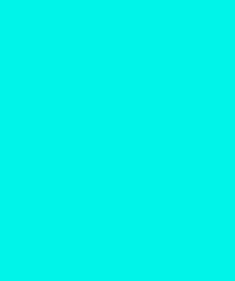

Hier ist etwas spezieller Inhalt nur für dieses div!

[test the build properties](https://learn.microsoft.com/en-us/visualstudio/msbuild/walkthrough-creating-an-msbuild-project-file-from-scratch?view=vs-2022#test-the-build-properties)

Also was bleibt mir übrig, zum Beispiel der mittlerweile gespeicherte Eintrag meiner
.LOG Datei, (eine .LOG Datei in Windows kann erstellt werden nach dem öffnen einer Textdatei und der Eingabe .LOG. Nach dem speichern und wieder öffnen ist ein möglicher Inhalt wie folgt):

.LOG
08:32 05.03.2025

strg a strg c strg v

[back](./)
