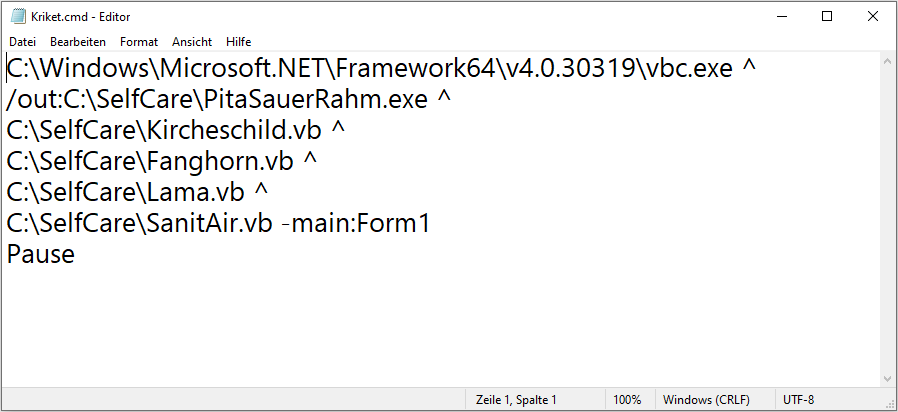
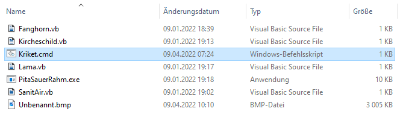

| More detailed description of the indentation processor |                                                                                                                               | The indentation processor features two key public methods: 'Indent' and 'UnIndent'.                                    |
| ------------------------------------------------------ | ----------------------------------------------------------------------------------------------------------------------------- | ---------------------------------------------------------------------------------------------------------------------- |
| `key:
   value`                                    | Calling the first method implies that we are going into a child node, probably more indented,                                 |                                                                                                                        |
| `key: value`                                           | But possibly the child is positioned directly after the parent node, like in:                                                 |                                                                                                                        |
|                                                        | When we continue moving through the stream and meet a new line, the indentation processor checks how much the indentation is. | <mark>If the indentation exceeds that of the previous line, then this line certainly belongs to the child node.</mark> |

id content Laws & Causes vsauce

Otherwise, this layer pretends that this is the end of the stream and sets the EOF.

When the indentation is more, we save the current level to be restored later.

[Yaml .NET Parser - Documentation](https://yaml-net-parser.sourceforge.net/)

    <button>Click Me</button>
  

[back](./)

[Create a Windows Forms application from the command line | Microsoft Learn Example](https://learn.microsoft.com/en-us/dotnet/desktop/winforms/how-to-create-a-windows-forms-application-from-the-command-line?view=netframeworkdesktop-4.8#example)

### Learn, offline

A process is to compare or strikethrough. . .

The offset is not with a printer.

#### By luck also; otherwise, a live account is not advised.

