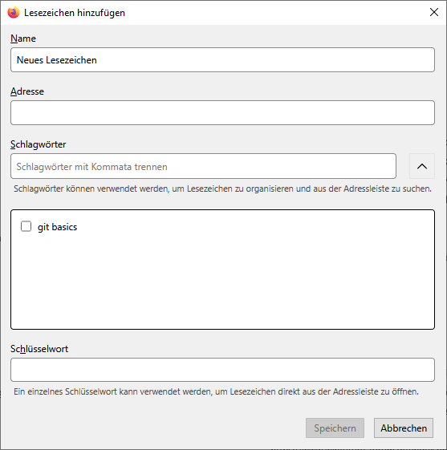

Hallo diese Seite ist dem Thema Binär gewidmet. Vor allem das sehr viele Programmiersprachen als unterschiedliche Deckel zu verstehen sind die trotzdem eine Binärdatei, einlesen können. Sprich Papier is geduldig, Schriftarten nicht immer.

###### LEVEL EINS BASEMENT

Ein Schildkrötgymnastikball.

assumption : ist eine fläche auf einer wand mit dem elbogen, der schulter, und der hand erreichbar?

conclusion : mit oder ohne ball, mit oder ohne ball touchdown

##### LEVEL ZWEI MARKIERUNG

Ein portable mini printer. - sharp pointer -

assumption:was ist das?

conclusion:ein divan ist eine sitzgelegenheit. - bug -

#### LEVEL DREI ERRINERUNGEN MUESSEN NICHT GELD SEIN

Definierte Listen. Oder auch nicht.

assumption:ich bin ok du bist ok, eigenschaften sind nicht eigenheiten.

conclusion:einen dokumentierten paragraphen mit eigenen wörtern und wortkreationen zieren können, oder ein worddokument erstellen oder und. . .

[seite : aremediadefinitions_GRAMMARLYHELPS](./aremediadefinitions_GRAMMARLYHELPS.md)

Text can be **bold**, _italic_, or ~~strikethrough~~

[return_JavaScript_MDN](https://developer.mozilla.org/en-US/docs/Web/JavaScript/Reference/Statements/return)

[Link to another page to start TOOL TIPING. -klein Adlerauge-](./another-page.html)

There should be whitespace between paragraphs. -by orderedlist-

Patterns are checked sequentially.
A pattern that negates a previous pattern will re-include file paths.

-klein Adlerauge klappert Punkte-

**Front Matter Defaults**

```
defaults:
  -
    scope:
      path: "" # an empty string here means all files in the project
    values:
      layout: "default"
```

<mark>an empty string here means all files in the project</mark>
HOLD RELEASE: I am all files, all files about my body

[White Space]([Lexical Format &#8212; WebAssembly 2.0 (Draft 2025-01-28)](https://webassembly.github.io/spec/core/text/lexical.html#white-space))

The only relevance of white space is to separate [tokens](https://webassembly.github.io/spec/core/text/lexical.html#text-token). <mark>It is otherwise ignored</mark>.

c        d    c        r

p        f    v        b

a crosssection between two rectangles, a square.
and only two corners of two rectangles have to be maintained for a position.

<div>
_config.yml can be replaced case pending by two or more files.
Eigenname_config.yml, Abroad_config.yml and so on.
</div>

- [ ] to move without calculations
  
  #### Makros sind mit Windows eine Linux Oberfläche

- [ ] re-include file paths

- [ ] with front matters escaped diving through configurations until reaching
  
  back to a front matter and new code window

- [ ] What is a switch for you, and LOG changes.

# Ball Farbübergänge und Strike.

Die Bewegungen zur Mitte der Gegenstände,
ist eine Wahl für Aggergationen aktiv. In der Mitte den Weg zu verlassen ist ein leben
des Gleichgewichts zwischen dem größten gemeinsamen Teiler und dem kleinsten
gemeinsamen Vielfachen.
Um einen lebensfeindlichen Bereich queren zu können, ist der Kommunikation zugeordnet das Kronenchakra viel weniger zu berücksichtigen als zum Beispiel das Wurzelchakra.
Einen Bereich zu verlassen deute ich nicht mit Wasser oder Luft sondern mit Wasser UND Luft. 99% der Körperform sind nicht 1% der Polygonen mit einem Gerätemanagmentzeichen.

### And a nested list:

- level 1 item
  
  - [Add build targets](https://learn.microsoft.com/en-us/visualstudio/msbuild/walkthrough-creating-an-msbuild-project-file-from-scratch?view=vs-2022#add-build-targets)
  - [Example](https://learn.microsoft.com/en-us/dotnet/standard/io/how-to-open-and-append-to-a-log-file#example)
    - [Test the build properties](https://learn.microsoft.com/en-us/visualstudio/msbuild/walkthrough-creating-an-msbuild-project-file-from-scratch?view=vs-2022#test-the-build-properties)
    - level 3 item

- level 1 item
  
  - level 2 item
  - level 2 item
  - level 2 item
  - build properties - what kind of properties have i build
  - build properties - with or without naming conventions

- level 1 item
  
  - level 2 item
  - level 2 item
    - and an applictaion
    - or a name
    - fullstop.
    - DOT

- 1. level 1 item
     
     ### Here is an unordered list:
     
     - Item foo
     
     - Item bar
     
     - Test the application by typing **Bin\MSBuildSample** to run the executable.
       
       The **Hello, world!** message should be displayed.
     
     - Now you can build the application by using the project file in which you used build properties to specify the output folder and application name.

#### Geräte sollten noch einmal angemeldet werden. OEM.

* \< hauptschluessel wert="deinHauptschluessel" \>
* \< passwort wert="deinPasswort" \>
* \< credentials wuzup \>

**Header 6**

|               |                                                            | conclusion                                |
|:------------- |:---------------------------------------------------------- |:----------------------------------------- |
| **asumption** | Ein Strike nach einem Farbverlauf ist ein Prozess.         | Welcher?                                  |
|               | Das Ikon der waybackmachine Seite ist links oben.          | Das Layout rechts unten ist kein Designe. |
|               | Tie figther Bügelmaschinen können Schnürsenkel reparieren. | Wozu?                                     |
|               | Gekaufte Gitarren stinken.                                 | Stimmt nicht. Signiert Snowboardmafia     |

### And an ordered list:

1. proof read
   
   
2. Ireverse checkup
3. Item three
4. language changes stay past changed link

<dl>
<dt>Name</dt>
<dd>-klein Adlerauge- ich</dd>
<dt>Born</dt>
<dd>1978</dd>
<dt>Birthplace</dt>
<dd>Europe</dd>
<dt>Color</dt>
<dd></dd>
</dl>

```
Long, single-line code blocks should not wrap. They should horizontally scroll if they are too long. This line should be long enough to demonstrate this.
```

```
The final element.
```
