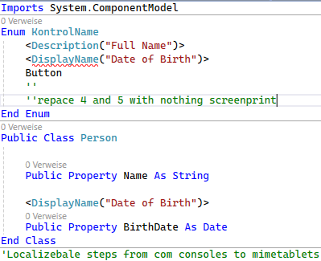
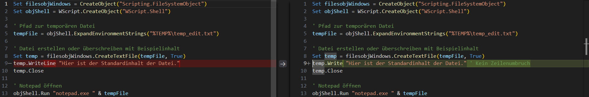
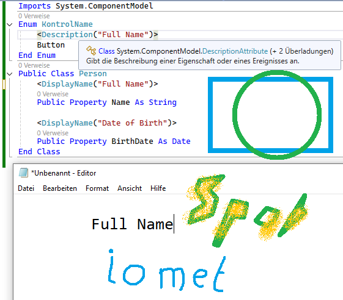

InkPaper Preisetiketten werden in einem Mömax Outlet der SCS nur Filialweit aktualisiert nicht über den gesamten Firmenbereich. Nur in dem Markt in dem die Preisschilder sind.
Ich fragte einen Verkäufer.

Wenn ein Preisschild abgelichtet werden könnte würde das Sinn machen wenn das Managment einen Produktbereich gegen einen Sticker ersetzen lassen würde.
Gratis sind Markdowndokumente und ich muss nicht mehr als einen code fence haben im Blocksatz und mit einem <pre> Tag. Nicht einmal als XML Element.
Schrödinger könnten auch Schlichtplanschachteln sein die im Altpapier das passende Mass hätten. Haben.
Oben sind Puzzleteile nicht weiter geschlifen.
Ein Icon eines Karteikartenreiters kann mit InkScape sowohl im Pixelbereich als auch im ScaleVektorGraphikbereich dargestellt werden.

# [VS Code: How to Compare Two Files (Find the Difference)](https://www.kindacode.com/article/vs-code-how-to-compare-two-files-find-the-difference#:~:text=Find%20the%20Difference)

# [(PDF) Evolution of spatiotemporal resolvability in the technical development of stop-motion](https://www.academia.edu/43666472/Evolution_of_spatiotemporal_resolvability_in_the_technical_development_of_stop_motion)
